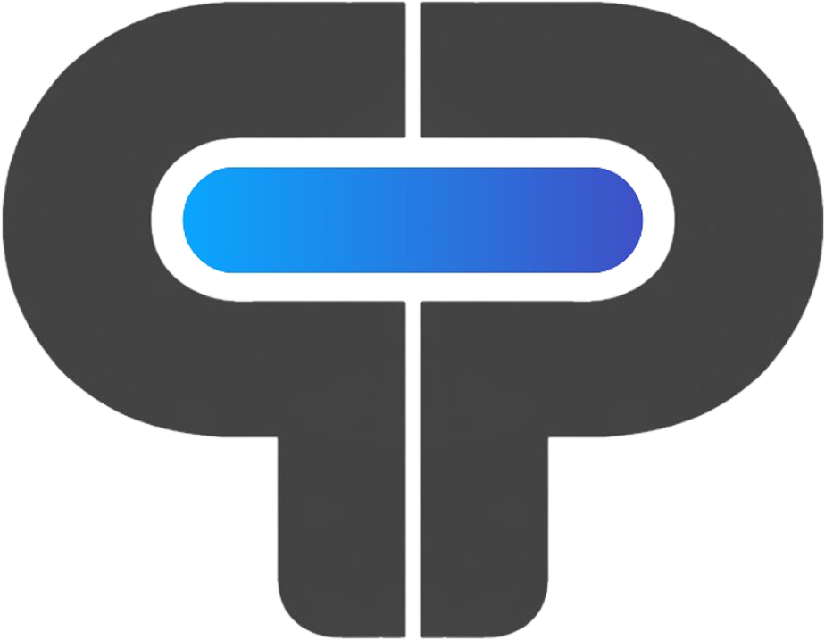
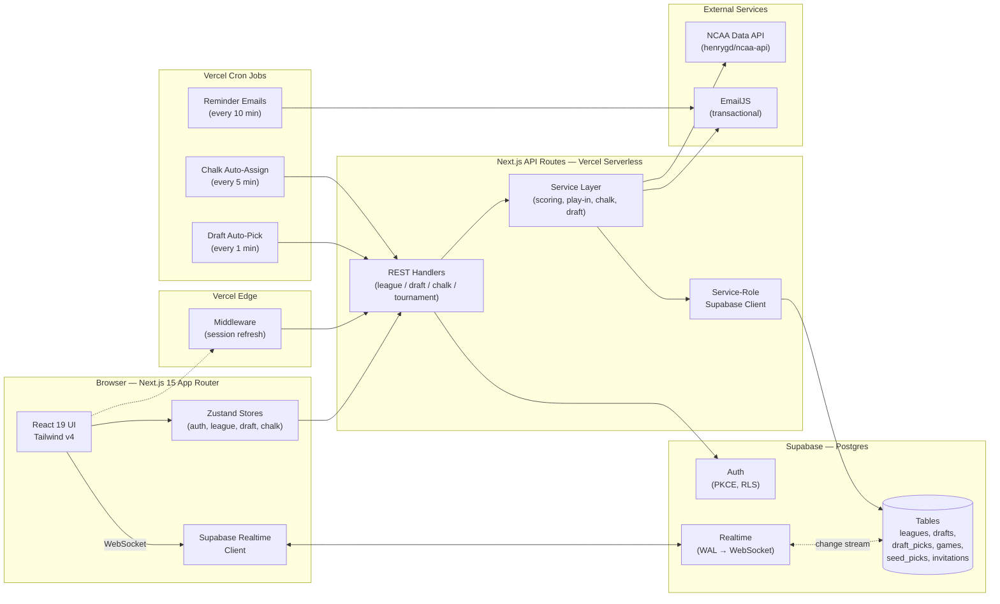
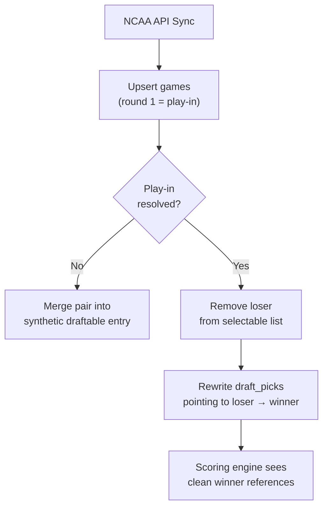

# PoolPick



**A real-time, multi-tenant tournament pool platform that turns March Madness into a competitive, socially-driven draft and prediction experience.**

[](https://your-production-domain.com)
[](https://nextjs.org/)
[](https://www.typescriptlang.org/)
[](https://supabase.com/)
[](https://vercel.com/)

---

## Overview

Tournament pools — office bracket challenges, friend-group drafts, family competitions — have historically lived in spreadsheets, group chats, and paper printouts. They break the moment a play-in game resolves, someone misses the draft, or a scoring rule needs tweaking. **PoolPick** reimagines this as a real-time, server-authoritative web app.

**What it does:**

- **Live Snake Draft** — Synchronous, timed drafting with a server-authoritative clock, presence tracking, and fair auto-pick fallbacks.
- **Chalk Challenge** — A "pick one team per seed" prediction game scored against real tournament outcomes.
- **Realtime Bracket & Scoring** — Results sync from a live NCAA feed and propagate instantly to every participant via Postgres change streams.
- **Paired-Partner Teams** — Two users can share a single draft slot and a single prediction sheet, with invites, scoring, and notifications all accounting for the shared identity.

**Live app:** [https://your-production-domain.com](https://your-production-domain.com) *(replace with production URL)*

---

## High-Level Architecture



**Data-flow highlights:**

- The **client** never talks to the database directly for writes — all mutations go through authenticated API routes that enforce deadlines, pick legality, and role permissions.
- **Reads** can stream directly from Postgres via Supabase Realtime WebSockets, giving every participant a live view of picks, game results, and bracket state without polling.
- **Cron jobs** act as safety nets that enforce correctness (auto-pick on expired deadlines, auto-assign missing predictions) even if every client is offline.

---

## Tech Stack & Tooling

### Frontend


### Backend (Serverless)


### Database, Auth & Realtime


### Data & Integrations


### DevOps & Tooling


---

## Core Technical Challenges & Solutions

This section documents the three most architecturally interesting problems this codebase solves. All descriptions are conceptual — no proprietary source is reproduced.

---

### 1. Server-Authoritative Snake Draft with Realtime + Cron Safety Net

**The problem.** A live draft is a small, synchronous multiplayer event. Multiple clients need the *same* view of "whose turn it is," a countdown that cannot be cheated or drifted by a slow machine, and guaranteed forward progress even if a user's laptop closes mid-turn. Naively trusting the client for turn order or timing opens the door to double-picks, race conditions on the same team, and deadlocked drafts.

**The conceptual approach.**

1. **Single source of truth in Postgres.** Each draft row stores the current `pick_deadline` (a UTC timestamp) and the configured seconds-per-pick. The client renders a countdown, but the *only* authority on "time remaining" is the server's wall clock compared against that timestamp.
2. **Unique constraints as a concurrency guardrail.** Draft picks carry two composite unique constraints: `(draft_id, pick_number)` and `(draft_id, tournament_team_id)`. Even if two clients race to claim the same pick slot or team, Postgres rejects the loser — the application layer never has to implement its own mutex.
3. **Realtime fan-out instead of polling.** Every client subscribes to `draft_picks` and `drafts` change streams via Supabase Realtime. A pick from one client becomes a WebSocket event that updates every other client's Zustand store — no request/response ping-pong.
4. **Cron as a liveness guarantee.** A Vercel cron job runs every minute, scanning for drafts whose `pick_deadline` has passed without a pick. It performs a deterministic auto-pick (highest seed remaining, alphabetical tie-break) — but *only* when neither the team owner nor their partner is currently connected via the presence channel. This means "someone is actively picking slowly" is never punished, but "everyone went to lunch" never stalls the draft.
5. **Admin pause semantics.** Pausing a draft snapshots the remaining time; resuming rebases `pick_deadline` to `now() + remaining`. No one loses time because a network blip or a commissioner's decision paused the clock.

**Illustrative pseudocode (generic — not the actual implementation):**

```ts
// On every pick request:
// 1. Authenticate the caller.
// 2. Load the draft row with FOR UPDATE semantics.
// 3. Assert: pick_deadline > now()  AND  caller owns the team on the clock.
// 4. INSERT draft_pick (unique constraints prevent double-claim).
// 5. Compute next picker via snake-order function; UPDATE draft with new deadline.
// 6. Postgres Realtime publishes the change → all clients receive it.
```

The result is a draft experience that feels instantaneous in the happy path, is provably fair under contention, and cannot be deadlocked by an offline user.

---

### 2. Play-In ("First Four") Graph Reconciliation

**The problem.** The NCAA tournament is marketed as a 64-team bracket, but it's technically a 68-team bracket: four "First Four" play-in games resolve *after* the draft typically opens. This creates two thorny states:

- **Pre-resolution:** a draft slot like "11-seed in the East" doesn't map to a single team — it's "Team A *or* Team B." A user needs to be able to draft that slot without knowing the eventual winner.
- **Post-resolution:** any draft pick or chalk prediction that pointed to the *losing* team is now invalid and needs to be retargeted to the winner.

**The conceptual approach.**

The system treats play-in games as first-class citizens in the data model (they're stored as `round_number = 1` games) and applies a two-phase reconciliation:

**Phase 1 — Merge unresolved pairs at read time.**
When building the list of "draftable teams" or "selectable seeds," a shared utility fetches all round-1 games for the tournament and folds them into the team list:

- If a play-in game is **unresolved**, both participating teams are removed from the list and replaced by a single synthetic entry labeled `"Team A / Team B"` that carries the seed of the pair.
- If a play-in game is **resolved**, the loser is removed from the list and the winner remains with its original identity.
- The total count of draftable slots is adjusted from 68 → 64 accordingly.

This utility is the single choke point used by *both* the draft picker and the Chalk Challenge pick board, so there is exactly one implementation of "what teams exist right now."

**Phase 2 — Retroactively correct picks on resolution.**
During every tournament sync, after upserting game results, a second utility scans `draft_picks` for rows that point to a play-in loser. For each, it rewrites the `tournament_team_id` to the winner's ID. This means:

- A user who drafted the synthetic pair entry pre-resolution automatically "owns" the winner.
- No data migration is required, no user action is needed, and the scoring engine downstream sees a clean foreign key to a real, advancing team.



The elegance of this design is that the messy 68→64 reality is quarantined inside two small, well-tested utilities. Every other part of the app — UI, scoring, leaderboards — gets to pretend it's a clean 64-team bracket.

---

### 3. Paired-Partner Invitation & Slot-Accounting Model

**The problem.** Users wanted to split a single "team" between two humans — a co-drafter, a spouse, a coworker — without inflating the league's member count or duplicating predictions. This seemingly simple feature touches nearly every subsystem:

- Invitations must reserve *one* team slot for a pair of users (primary + partner).
- Draft picks must be legal for *either* member of the pair.
- Chalk Challenge picks must be keyed to the *team owner*, not the individual, so partners share a single prediction sheet.
- Leaderboards, scoring, and notifications must address the pair as one entity ("Michael and Jon").
- Cancelling the primary's invite must cascade to the partner's invite; either partner leaving the team must leave the slot in a defensible state.

**The conceptual approach.**

1. **Invitation linkage.** The `invitations` table carries a self-referential `partner_of` column. A primary invite stands alone; a partner invite stores the primary invite's ID. This makes "cancel the pair" a single-query cascade and prevents orphaned partner invites.
2. **Slot accounting decoupled from member count.** The league's `max_members` constant counts *teams*, not humans. Partners are added to a `team_members` join table with `role = 'partner'` and are explicitly excluded from slot-availability math. This preserves the mental model "an 8-team league" regardless of how many humans fill those 8 slots.
3. **Ownership semantics for shared resources.** Chalk Challenge predictions (`seed_picks`) are keyed by `user_id = team_owner_id`, deliberately. Either partner's UI writes to the owner's row, so their predictions are automatically unified with no merge logic. Draft picks are keyed by `team_id`, so presence and auto-pick logic check "is any team member online" rather than a single user.
4. **Display-name resolution as a shared utility.** A small helper resolves a team's display name based on who's attached ("Michael," "Michael and Jon," or the team's custom name), used everywhere that renders a team — leaderboard, tracker, bracket, emails. One function, one source of truth.
5. **Atomic creation flows.** Creating a league, joining via a paired invite, or transferring ownership are all wrapped in server-side handlers that use the service-role Supabase client to perform multi-table writes atomically. The browser never sees a half-created league.

The design principle: **model the pair as a first-class concept, not a post-hoc hack.** Every table that could be confused about "team vs. user" has a deliberate answer, and every UI surface that displays a team flows through a single display-name helper.

---

## Security & Infrastructure Highlights

### Authentication & Authorization

- **PKCE auth flow** via Supabase Auth, with sessions stored in `localStorage` on the client and refreshed by Next.js **edge middleware** on every request. Tokens never leave secure channels and are rotated automatically.
- **Three-tier Supabase client model:**
  - *Browser client* — anon key, RLS-enforced, read-only for most tables.
  - *Server client* — cookie-bound, RLS-enforced, used in route handlers that act on behalf of the user.
  - *Admin client* — service-role key, **server-only**, used exclusively for multi-table writes that require bypassing RLS (e.g., atomic league creation, paired-invite cascades). Never imported into client code.
- **Row-Level Security on every table.** Every Postgres table has explicit RLS policies. A leaked anon key cannot read another user's league, draft picks, or predictions.

### Server-Authoritative Correctness

- **Deadlines live in Postgres**, not in JavaScript. The draft timer and Chalk Challenge lock are enforced by comparing `now()` to a stored UTC timestamp — clock drift on a client machine cannot grant extra time.
- **Unique constraints on critical tables** (`draft_picks.pick_number`, `draft_picks.tournament_team_id`) use the database itself as the concurrency oracle. No application-level locks, no Redis, no queue — just Postgres doing what Postgres is best at.
- **Cron jobs as liveness guarantees.** Four scheduled Vercel jobs enforce correctness independent of client activity: auto-pick expired draft turns, auto-assign missing Chalk predictions, send pre-deadline reminders. If every browser on earth closed, the app would still finish the draft and score the tournament correctly.

### Infrastructure & Performance

- **Edge-first session handling.** Auth cookie refresh happens in Vercel edge middleware (sub-50ms globally), keeping the authenticated round-trip fast regardless of user location.
- **Realtime over polling.** Live draft updates, bracket advancement, and scoring changes stream from Postgres via Supabase Realtime WebSockets. The app serves hundreds of simultaneous viewers without hammering the API.
- **Stateless serverless API.** Every API route is a pure function of its request + database state, making horizontal scale on Vercel automatic and cold-start impact minimal.
- **Optimistic UI with server reconciliation.** Chalk picks apply instantly in the UI, then reconcile against the server response — if a save fails (e.g., deadline passed mid-click), the UI rolls back. Users feel a snappy app without sacrificing correctness.
- **Zero-downtime schema evolution.** All schema changes are captured as versioned SQL migrations under `supabase/migrations/`, reviewed in pull requests, and applied via Supabase CLI.

### Operational Safety

- **Secrets never committed.** Service-role keys and API credentials live only in Vercel's encrypted environment variable store and a local `.env.local` that is explicitly gitignored.
- **Admin actions scoped by role.** League-admin-only operations (launching drafts, setting deadlines, managing members) are gated both by Postgres RLS policies *and* by explicit role checks in the API layer — defense in depth.
- **Idempotent sync.** The tournament data sync is safe to run repeatedly; upserts are keyed on stable IDs and play-in correction is designed to be a no-op when already applied.

---

## A Note on This README

This document intentionally describes *architecture and problem-solving* rather than implementation detail. Code samples are generic illustrations, not reproductions of the production source. If you're a hiring manager or engineer evaluating this work and would like a deeper walkthrough, I'm happy to screen-share the codebase and discuss trade-offs in detail.

---

*Built with Next.js, TypeScript, Supabase, and a lot of care about edge cases.*
